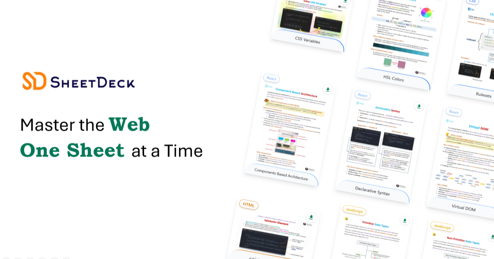

# Welcome to SheetDeck :orange_heart:

A collection of web development cheat sheets and visuals I’ve put together! I have tried my best to fit in all the essential details for a topic in a single cheat sheet. Hope they help you out in your coding journey!

I’ll be adding more cheat sheets here over time! :sparkles:

 

## 🌐 Cheat Sheets Available For

Cheat sheets are currently available for the following languages :

| Language                                                                                                                     | Topics                                                                    | Total |
| ---------------------------------------------------------------------------------------------------------------------------- | ------------------------------------------------------------------------- | ----- |
|   
   **HTML** 
           | Concepts (4) • Attributes (7) • Elements (2)                              | 13    |
|   
   **CSS** 
              | Concepts (5) • Properties (5) • Pseudo Classes (4) • Selectors (1)        | 15    |
|   
   **JavaScript** 
 | Concepts (6) • Operators (6) • DOM manipulation (2) • Advanced Syntax (5) | 19    |
|   
   **React** 
        | Concepts (3)                                                              | 3     |

 

## :computer: Tech Stack

SheetDeck is built using the following technologies :

- [Next.js](https://nextjs.org/) - a framework for building server-rendered React applications
- [Tailwind CSS](https://tailwindcss.com/) - a utility-first CSS framework

 

## 📄 License

- The **codebase** of this project is open source and licensed under the [MIT License](./LICENSE).
- The **cheat sheet content** is not open source. Please read the [Content License](./CONTENT_LICENSE.txt) before use.

 

## 🚫 Contributions

This is a personal project — all cheat sheets and visuals are written and maintained by me.  
I'm NOT accepting pull requests, issues, or external contributions.

• • •

## ☕️ Support Me

Stay updated with my latest cheat sheets and web development tips by following me on [X (Twitter) @RitikaAgrawal08](https://x.com/RitikaAgrawal08).

If you enjoy my content and would like to support my work, feel free to [buy me a coffee](https://buymeacoffee.com/ritikaagrawal08). Your support means a lot and helps me create more useful resources!

**Thanks so much! Happy Coding!** :sparkles:
